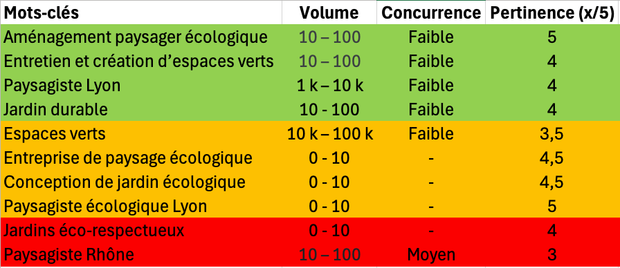

# MAISON VERTE

## Étude préalable

- Pourquoi ?
    - Développer la visibilité en ligne, attirer des clients sensibles à l’écologie dans la région Rhône-Alpes.
    - Augmenter les demandes de devis
    - Mettre en avant le positionnement 100% écolologique.

- Comment ?
    - Recherche de mots-clés ciblés, création de contenus pédagogiques (blog, fiches pratiques), optimisation technique du site.
    - Stratégie de contenu : Pages dédiées aux services et à la localisation (Lyon, Vénissieux, etc.).

- Contre qui ?
    - Paysagistes locaux traditionnels, pas nécessairement sur l’écologie.
    - Grandes enseignes de jardinerie : Forte autorité web, mais moins spécialisées dans l’aménagement 100% durable.
    - Autres paysagistes écologiques : Quelques acteurs mettant l’accent sur la biodiversité.

### Premiers recherches
#### Mots-clés populaires (Google Keyword Planner)
> Google Keyword Planner fournit une première estimation des volumes de recherche des mots-clés donnés et en propose d'autres similaires.

Des mots-clés généralistes à fort volume (10k – 100k) comme « espaces verts » mais avec une concurrence signalée comme Faible.
Des termes plus précis, comme « aménagement paysager » ou « entreprise de paysage » (1k – 10k recherches mensuelles), eux aussi avec une concurrence généralement Faible.
Un mot-clé plus spécifique, « aménagement extérieur terrasse », dont la concurrence est jugée Élevée, malgré un volume de 1k – 10k.
Ces données montrent qu’il existe à la fois :

- Un fort potentiel de visibilité via des requêtes généralistes (espaces verts, aménagement paysager).
- Une opportunité de se démarquer sur des expressions plus spécialisées (paysagiste écologique, entreprise paysagère éco-responsable), même si le volume de recherche peut être plus faible.

## Étude Concurrentielle via SERP – Mots-clés Repérés

### 1. Cécile Charpentier (cecile-charpentier.com)
- **Paysagiste conceptrice**  
- **Écologie**  
- **Art des jardins**  
- **Lyon**

---

### 2. Solyev (solyev.fr)
- **Paysagiste à Lyon**  
- **Entretien & création paysagère**  
- **Espaces verts**  
- **Sites d’entreprises / Espaces publics**

---

### 3. Eco Pâturage Lyon (paysagesetjardinsdeau.com)
- **Éco-pâturage**  
- **Gestion des espaces verts**  
- **Solution douce**  
- **Collectivités / Établissements publics / Entreprises**

---

### 4. Authentique Jardin / K. Vallet Paysagiste (kvalletpaysagiste.fr)
- **Conception de jardin écologique**  
- **Étude du terrain**  
- **Devis personnalisé**  
- **Sainte-Foy-Lès-Lyon**

---

### 5. Terrestris (terrestris.fr)
- **Paysagiste à Lyon ouest**  
- **Création et entretien de parcs et jardins**  
- **Jardins ornementaux et potagers**  
- **Plantation / Engazonnement**

---

## 6. Alliance Paysage (reseau-alliancepaysage.com)
- **Paysagiste Rhône**  
- **Jardin durable et écologique**  
- **Plantes locales**  
- **Matériaux recyclables**

---

### 7. Les Jardins de Gally (lesjardinsdegally.com)
- **Agence en Rhône-Alpes**  
- **Coteaux du lyonnais**  
- **Métiers de spécialistes**  
- **Espaces verts**  
- **Taluyers**

---

### 8. Arborea Jardin Conseil (arborea-paysagiste.fr)
- **Jardins éco-respectueux à Lyon**  
- **Création de zones de fraîcheur**  
- **Potagers hors-sol**  
- **Chemins sensoriels**

---

### 9. Jardinier des Gones (jardinierdesgones.fr)
- **Eco-jardinage à Lyon**  
- **Grand Lyon**  
- **Interventions en vélo cargo**  
- **Démarche écologique**

---

### 10. Osio Paysagiste (osio-paysagiste.com)
- **Entretien et création d’espaces verts sur Lyon**  
- **Conception paysagère**  
- **Réhabilitation d’espaces végétalisés**

---

## Synthèse des Mots-clés les plus et les moins utilisés

- **Les plus utilisés**  
  - « Paysagiste » (très fréquent, souvent couplé à « Lyon » ou « Rhône »)  
  - « Espaces verts » (présent sur plusieurs sites)  
  - « Création / Entretien »

- **Les moins utilisés / plus spécifiques**  
  - « Éco-pâturage »
  - « Jardins éco-respectueux » / « Jardin durable » 
  - « Potagers hors-sol », « Chemins sensoriels » (très niche, ne concerne pas forcement notre sujet)

## Intentions de Recherche Principales

1. **Informationnelle** : L’utilisateur souhaite s’informer via des guides, conseils ou tutoriels.

2. **Service** : L’utilisateur cherche à acheter ou demander un service.

3. **Navigation** : L’utilisateur connaît déjà une marque/entreprise et veut accéder à son site ou ses coordonnées.

4. **Commerciale** : L’utilisateur compare différentes offres.

## Heatmap des mots-clés

#### Légende :
- **Vert** : Mots-clés les plus intéressants
- **Jaune** : Mots-clés à potentiel
- **Rouge** : Mots-clés à faible potentiel